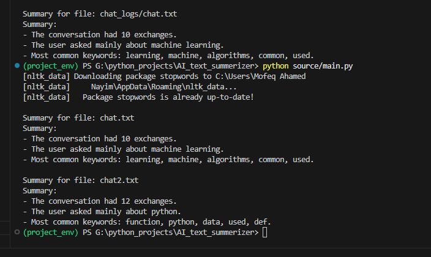

# AI Chat Log Summarizer

A Python-based tool to parse AI chat logs and generate concise summaries including message counts and key topics using NLP techniques.

---

## Features

- Reads `.txt` chat logs formatted with `User:` and `AI:` messages.
- Separates messages by speaker.
- Counts total messages and messages per speaker.
- Extracts top keywords using TF-IDF with stop word removal.
- Infers main conversation topic based on keywords.
- Supports summarizing single chat log files or all logs inside a folder.

---

## Installation

1. Clone the repository:

git clone https://github.com/mosfeqahamed/AI_text_summerizer.git

2. python -m venv project_env
source project_env/bin/activate    # Linux/macOS
project_env\Scripts\activate       # Windows 

3. pip install -r requirements.txt

4. Run the script

python source/main.py
